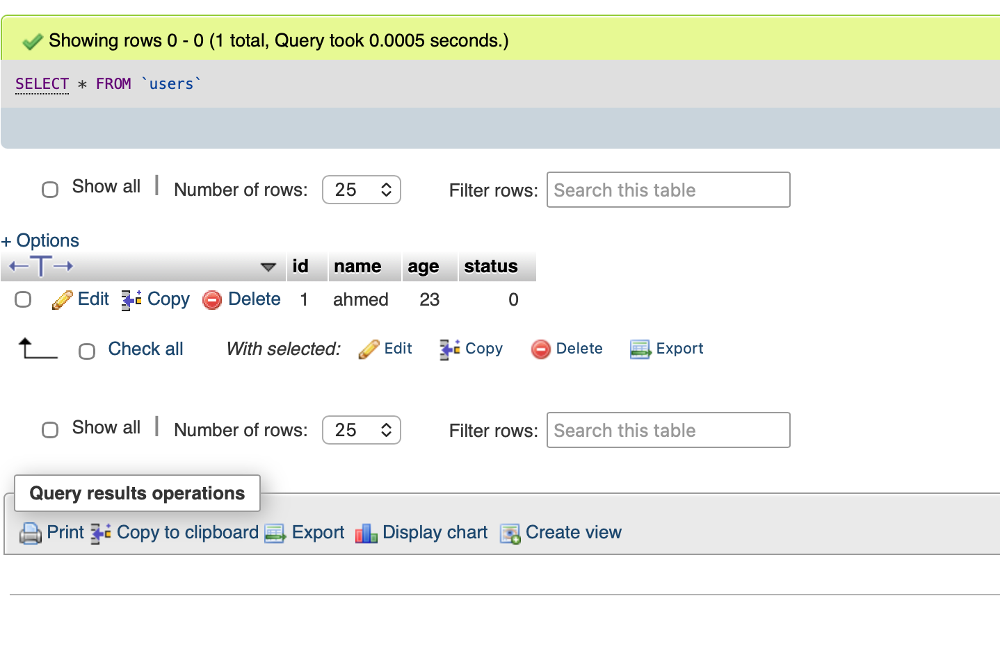
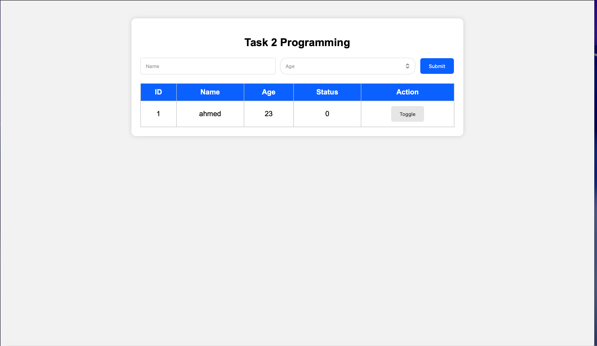

# Task 2 - Web Programming

## Overview
This project is a simple web application developed using HTML, CSS, JavaScript, PHP, and MySQL.

The application allows users to:
- Add a new user.
- Store user data in a MySQL database.
- Display all saved records.
- Toggle the status between 0 and 1 instantly without refreshing the page.

---

## Technologies Used

- HTML
- CSS
- JavaScript
- PHP
- MySQL
- InfinityFree Hosting

---

## Project Files

- index.php
- db.php
- insert.php
- toggle.php
- style.css
- script.js

---

# Implementation Steps

## Step 1 - Create Hosting Account
Created a free hosting account using InfinityFree.

## Step 2 - Create MySQL Database
Created a MySQL database named:

```
if0_42420506_webtask
```

---

## Step 3 - Create Users Table

Created a table called **users** with the following columns:

| Column | Type |
|---------|------|
| id | INT (Primary Key, Auto Increment) |
| name | VARCHAR(100) |
| age | INT |
| status | TINYINT(1) Default 0 |

---

## Step 4 - Database Connection

Connected the website to the MySQL database using PHP in **db.php**.

---

## Step 5 - Build the User Interface

Designed the webpage using HTML and CSS.

The page contains:

- Name input
- Age input
- Submit button
- Table for displaying users

---

## Step 6 - Insert Records

Implemented **insert.php** to save user data into MySQL.

---

## Step 7 - Display Records

Displayed all database records dynamically in the table.

---

## Step 8 - Toggle Status

Implemented **toggle.php** to switch the status value between 0 and 1.

The status updates instantly using JavaScript without refreshing the page.

---

## Final Result

The application successfully:

- Stores user information.
- Displays all records.
- Updates the status instantly.
- Uses HTML, CSS, JavaScript, PHP, and MySQL.

  ## Screenshots

### Database


### Users Table


### Homepage


